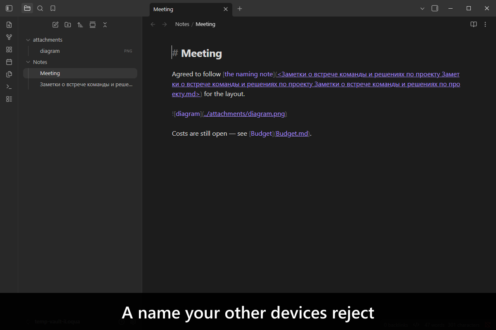
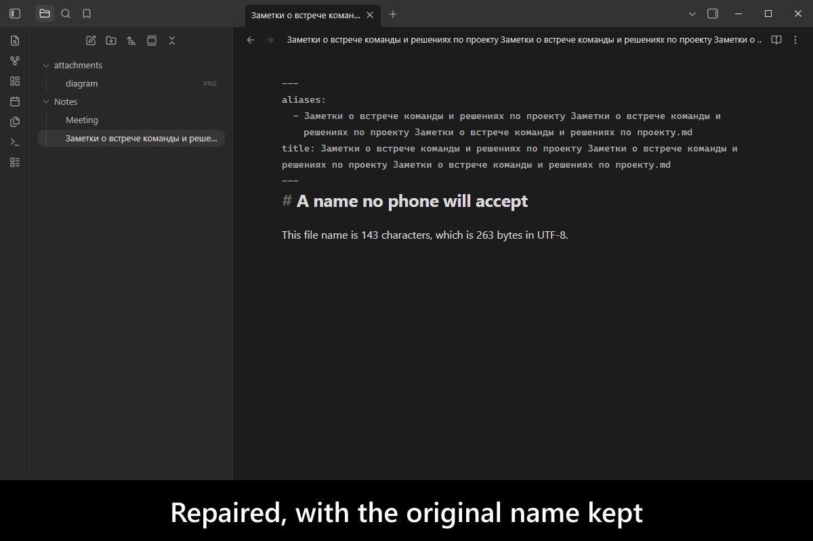
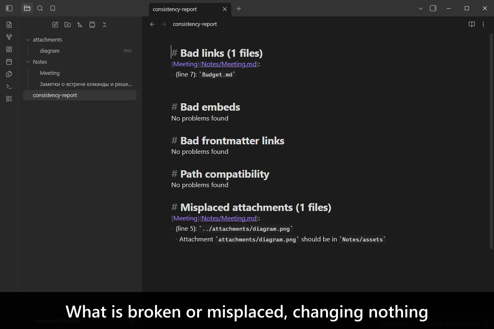
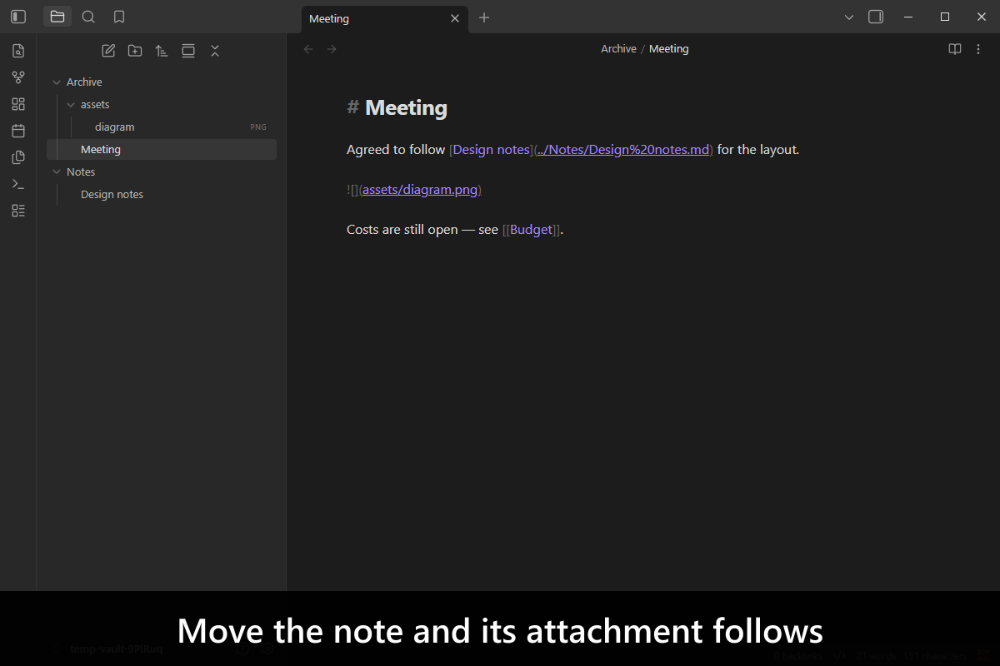
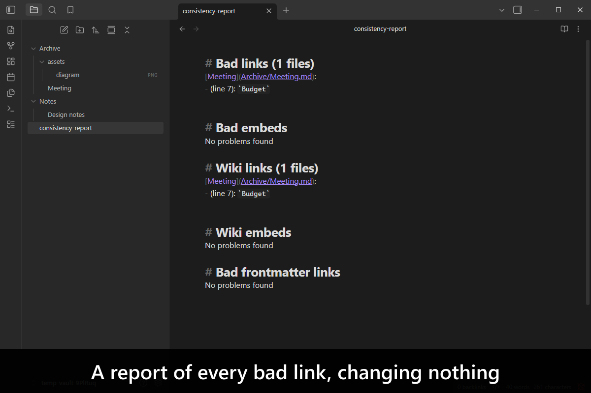
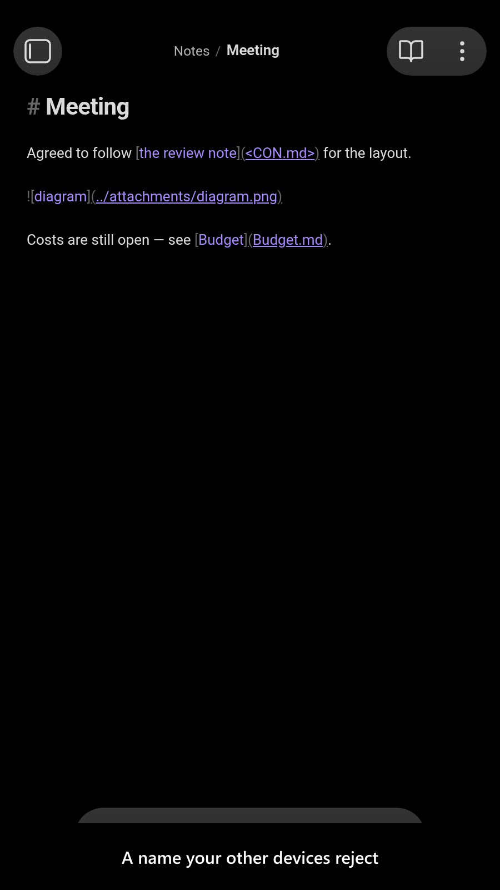
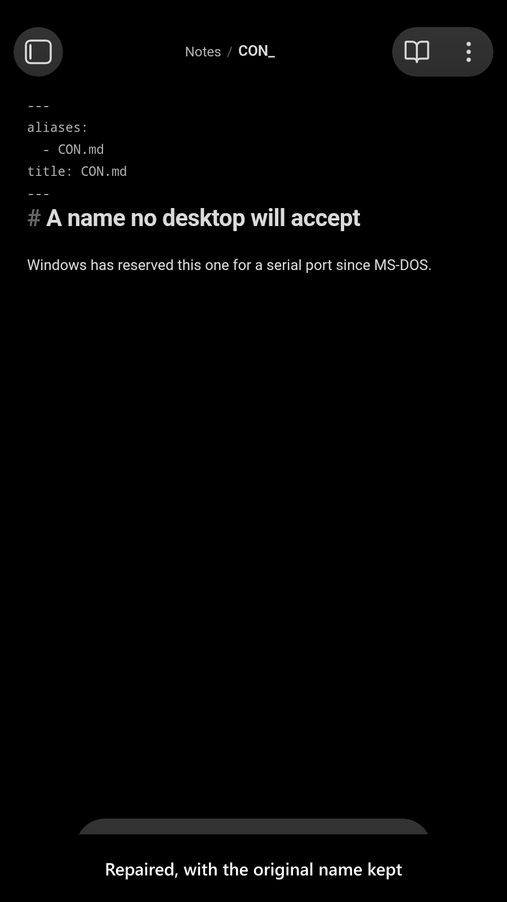
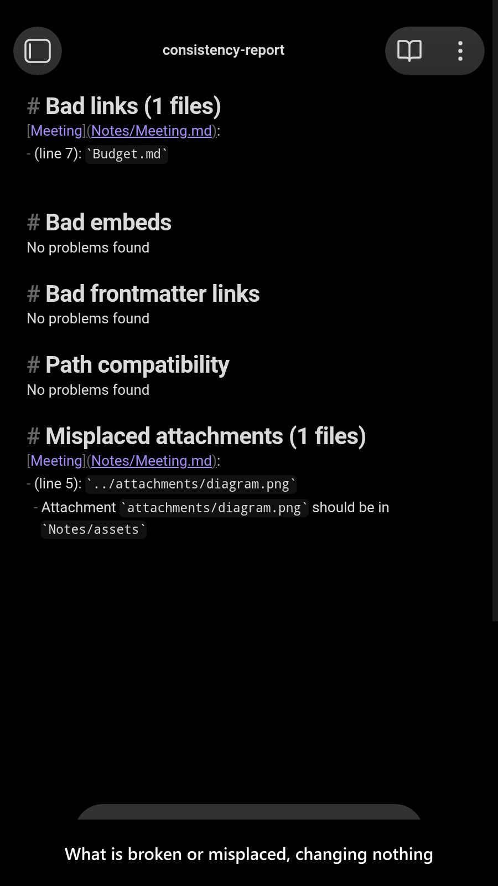
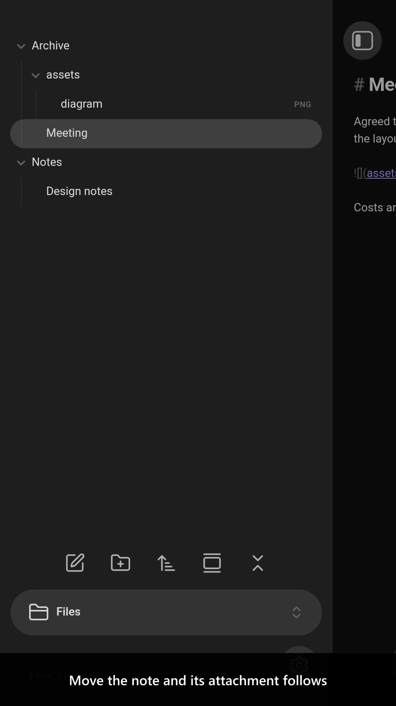
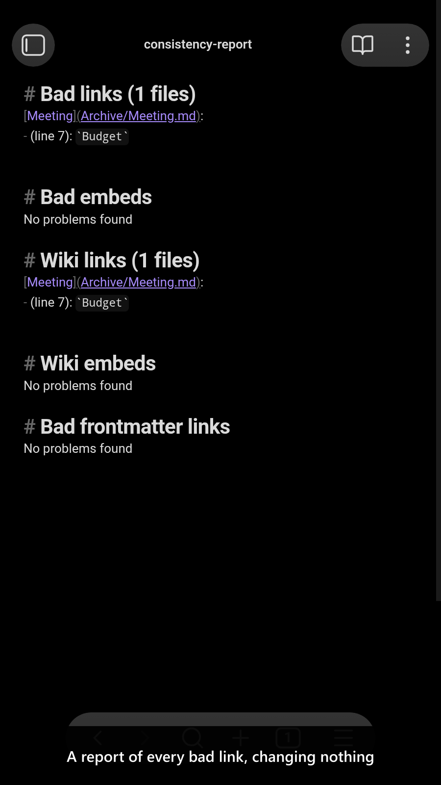

# Consistent Attachments and Links

[](https://www.buymeacoffee.com/mnaoumov) [](https://github.com/mnaoumov/obsidian-consistent-attachments-and-links/releases) [](https://github.com/mnaoumov/obsidian-consistent-attachments-and-links/releases) [](https://github.com/mnaoumov/obsidian-consistent-attachments-and-links)

[Obsidian](https://obsidian.md/) resolves links with a clever search that only Obsidian has, so a vault can be perfectly navigable inside it and full of dead links the moment you open a note anywhere else — in another editor, published to GitHub, or exported as a folder. Move a note and its attachments stay behind; delete one and you either strand files or take someone else's with you.

This plugin makes a vault consistent in the plainest sense: every link a real relative path in standard Markdown, every attachment in its note's own folder. Then it keeps it that way — moving attachments with their note, updating links on rename, and cleaning up what is left behind.

> [!WARNING]
>
> As the plugin might change your vault layout, it is crucial that you backup your vault before making any massive changes with this plugin!

<!-- markdownlint-disable MD033 -->

<a href="https://github.com/dy-sh/obsidian-consistent-attachments-and-links/blob/HEAD/images/screenshots/screenshot-desktop-1.png"></a>

<details>
<summary>More screenshots</summary>

<div>
<a href="https://github.com/dy-sh/obsidian-consistent-attachments-and-links/blob/HEAD/images/screenshots/screenshot-desktop-2.png"></a>
<a href="https://github.com/dy-sh/obsidian-consistent-attachments-and-links/blob/HEAD/images/screenshots/screenshot-desktop-3.png"></a>
<a href="https://github.com/dy-sh/obsidian-consistent-attachments-and-links/blob/HEAD/images/screenshots/screenshot-desktop-4.png"></a>
<a href="https://github.com/dy-sh/obsidian-consistent-attachments-and-links/blob/HEAD/images/screenshots/screenshot-desktop-5.png"></a>
<a href="https://github.com/dy-sh/obsidian-consistent-attachments-and-links/blob/HEAD/images/screenshots/screenshot-mobile-1.png"></a>
<a href="https://github.com/dy-sh/obsidian-consistent-attachments-and-links/blob/HEAD/images/screenshots/screenshot-mobile-2.png"></a>
<a href="https://github.com/dy-sh/obsidian-consistent-attachments-and-links/blob/HEAD/images/screenshots/screenshot-mobile-3.png"></a>
<a href="https://github.com/dy-sh/obsidian-consistent-attachments-and-links/blob/HEAD/images/screenshots/screenshot-mobile-4.png"></a>
<a href="https://github.com/dy-sh/obsidian-consistent-attachments-and-links/blob/HEAD/images/screenshots/screenshot-mobile-5.png"></a>
</div>

</details>

<!-- markdownlint-enable MD033 -->

## Demo vault

**The documentation is a demo vault.** Every feature has a note that explains what it does and why you would want it, with example notes to run it against.

**[Start reading here](<./demo-vault/00 Start.md>)** — it is plain markdown, so it works on GitHub with nothing installed.

A copy of the vault ships with every release. You can access it via any of the following:

1. Running the **Consistent Attachments and Links: Open demo vault** command.
2. Downloading `consistent-attachments-and-links-demo-vault-<version>.zip` (`<version>` is the release version) from the [Releases](https://github.com/mnaoumov/obsidian-consistent-attachments-and-links/releases).
3. Browsing its source in [`demo-vault/`](./demo-vault/README.md) in this repository.

## What it does

- **Attachments follow their note.** Move or delete a note and its attachments go with it — safely, never taking a file another note still references. [01 Attachments move with their note](<./demo-vault/01 Attachments move with their note.md>)
- **Links stay valid.** Renaming and moving rewrite the links that point at what you touched. [02 Links stay valid on rename and move](<./demo-vault/02 Links stay valid on rename and move.md>)
- **Audit the whole vault** and get a report of bad links, bad embed paths, wikilinks and wiki-embeds, changing nothing. [03 Check vault consistency](<./demo-vault/03 Check vault consistency.md>)
- **Convert an existing vault** — wikilinks to Markdown links, paths to relative, attachments collected into place, empty folders swept — in one command or step by step. [04 Reorganize and convert links](<./demo-vault/04 Reorganize and convert links.md>) · [07 Commands](<./demo-vault/07 Commands.md>)
- **Settings**, including which of the destructive operations are unlocked. [05 Settings](<./demo-vault/05 Settings.md>)
- **Obsidian's own settings matter too** — link format, attachment location — and the vault explains which ones to change and why. [06 Recommended Obsidian settings](<./demo-vault/06 Recommended Obsidian settings.md>)

<!-- markdownlint-disable MD033 -->
## `Attachment Subfolder` setting <span id="attachment-subfolder-setting"></span>
<!-- markdownlint-enable MD033 -->

Moved to [06 Recommended Obsidian settings](<./demo-vault/06 Recommended Obsidian settings.md>).

Since [v3.0.0](https://github.com/dy-sh/obsidian-consistent-attachments-and-links/releases/tag/3.0.0) this setting is no longer managed by the plugin; it follows Obsidian's built-in [`Default location for new attachments`](https://help.obsidian.md/Editing+and+formatting/Attachments#Change+default+attachment+location). This heading stays so links already pointing at it keep resolving.

## Installation

The plugin is available in [the official Community Plugins repository](https://community.obsidian.md/plugins/consistent-attachments-and-links).

### Beta versions

To install the latest beta release of this plugin (regardless if it is available in [the official Community Plugins repository](https://community.obsidian.md) or not), follow these steps:

1. Ensure you have the [BRAT plugin](https://community.obsidian.md/plugins/obsidian42-brat) installed and enabled.
2. Click [Install via BRAT](https://intradeus.github.io/http-protocol-redirector?r=obsidian://brat?plugin=https://github.com/dy-sh/obsidian-consistent-attachments-and-links).
3. An Obsidian pop-up window should appear. In the window, click the `Add plugin` button once and wait a few seconds for the plugin to install.

## Debugging

By default, debug messages for this plugin are hidden.

To show them, run the following command:

```js
window.DEBUG.enable('consistent-attachments-and-links');
```

For more details, refer to the [documentation](https://mnaoumov.dev/obsidian-dev-utils/guides/debugging/).

## Changelog

All notable changes to this project will be documented in the [CHANGELOG](./CHANGELOG.md).

## Contributing

Contributions are welcome — see [CONTRIBUTING](./CONTRIBUTING.md) to get set up.

## Support

<!-- markdownlint-disable MD033 -->

<a href="https://www.buymeacoffee.com/mnaoumov" target="_blank"></a>

<!-- markdownlint-enable MD033 -->

## My other Obsidian resources

[See my other Obsidian resources](https://github.com/mnaoumov/obsidian-resources).

## License

© [dy-sh](https://github.com/dy-sh/)

Maintainer: [Michael Naumov](https://github.com/mnaoumov/)
