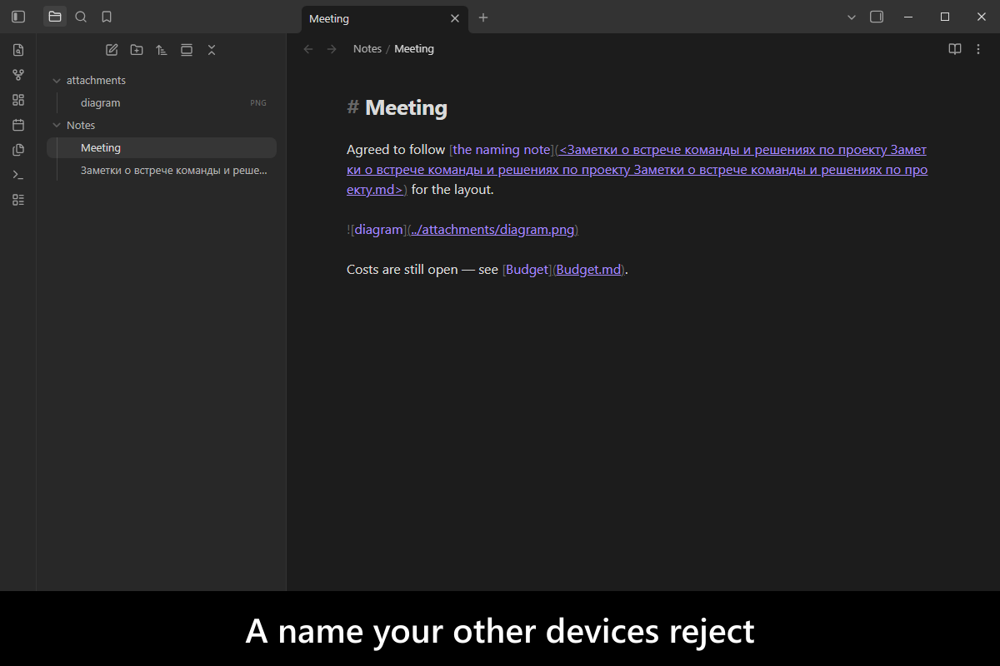
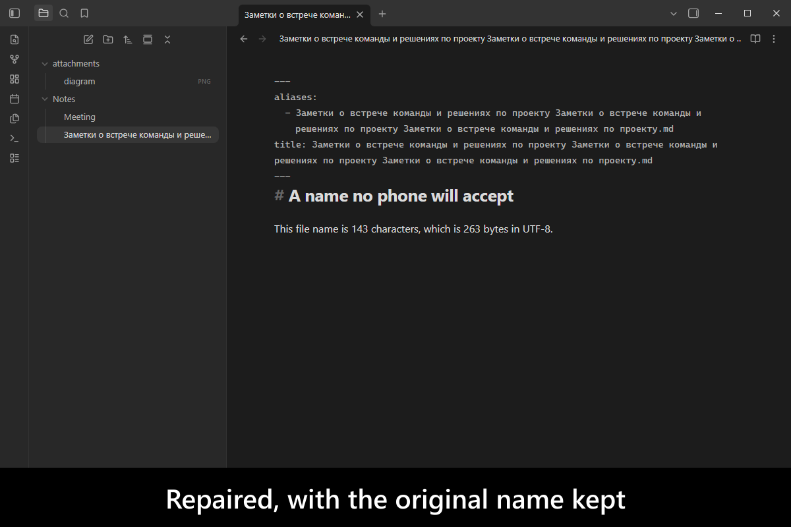
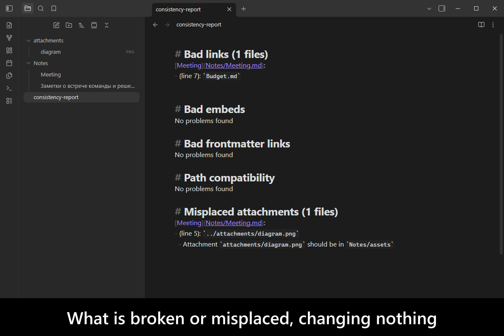
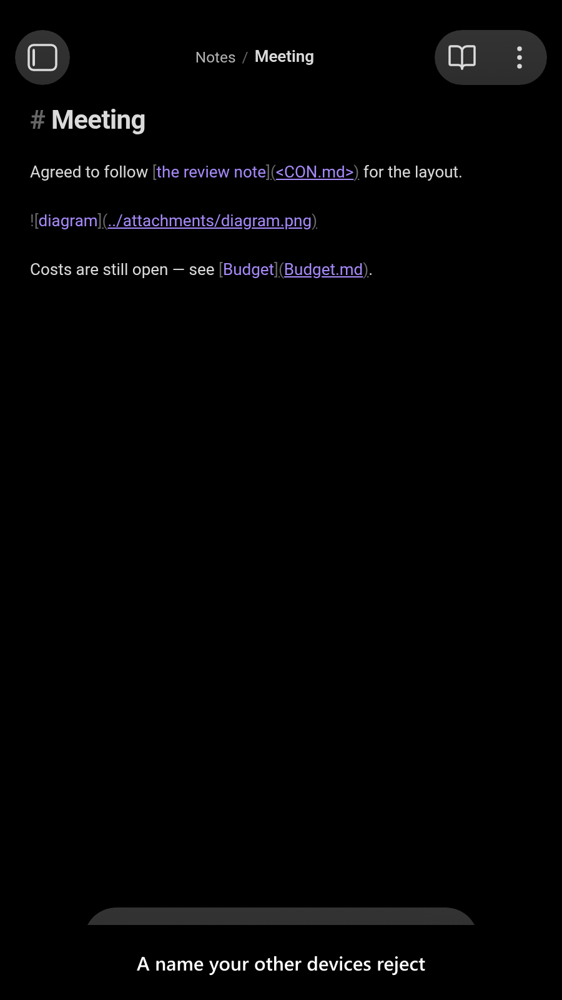
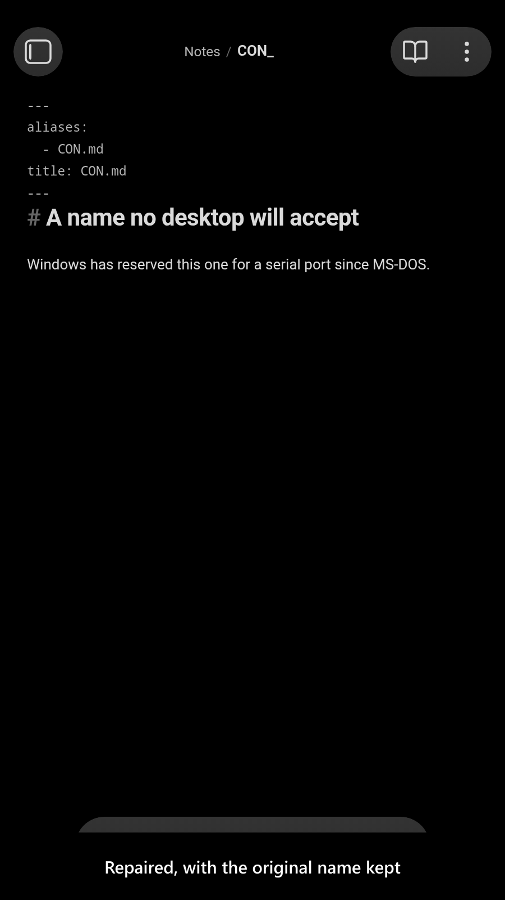
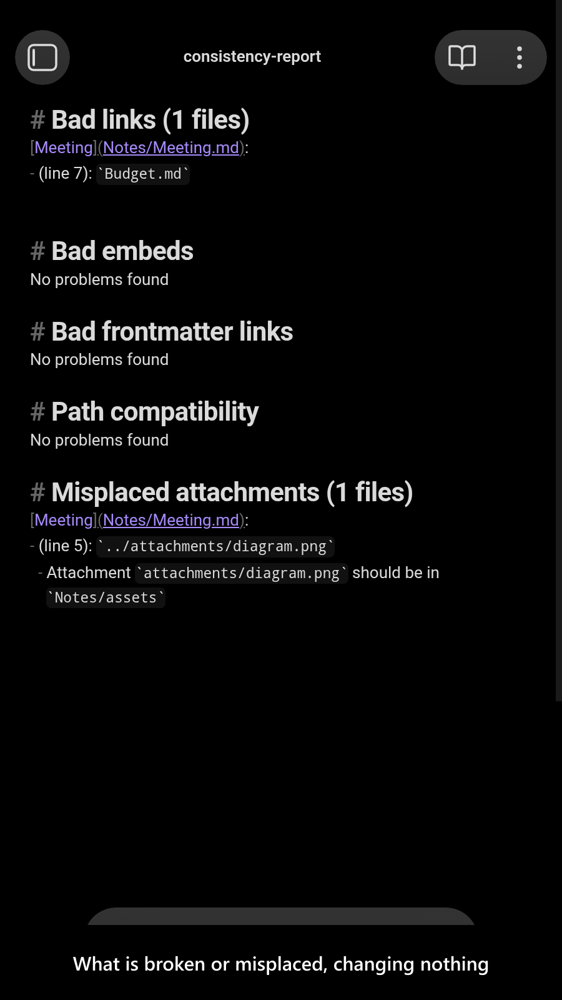

# Consistent Attachments and Links

[](https://www.buymeacoffee.com/mnaoumov) [](https://github.com/dy-sh/obsidian-consistent-attachments-and-links/releases) [](https://github.com/dy-sh/obsidian-consistent-attachments-and-links/releases) [](https://github.com/dy-sh/obsidian-consistent-attachments-and-links)

[Obsidian](https://obsidian.md/) resolves links with a clever search that only Obsidian has, so a vault can be perfectly navigable inside it and full of dead links the moment you open a note anywhere else — in another editor, published to GitHub, or exported as a folder.

This plugin makes that visible. It does two things:

- **Check vault consistency** audits the whole vault and writes a report, changing nothing: bad links, bad embeds and bad frontmatter links (every link whose written path does not itself lead to its target), attachments sitting outside their note's attachment folder, and names and paths a platform you sync to would reject.
- **Fix incompatible paths** repairs those names and paths — not because Obsidian cannot open them, but because that platform's filesystem cannot store them. Links follow the rename, and the original name is kept.

It never rewrites a link into a style, moves an attachment or cleans up folders: where those matter, it reports and leaves the change to you.

> [!IMPORTANT]
>
> This plugin requires [Advanced Rename and Delete Handler](https://obsidian.md/plugins?id=advanced-rename-and-delete-handler), which since **4.0.0** handles renames and deletions for the whole vault — keeping attachments traveling with their note and links rewritten when you move, rename or delete one — so several plugins can no longer fight over it. This plugin loads nothing until that plugin is installed, explains why, and installs it in one click — which changes nothing on its own, since its defaults do nothing until you turn renames or deletions on. It then offers to hand your old settings across.

<!-- Separates the callouts; without it markdownlint reads them as one blockquote. -->

> [!NOTE]
>
> Upgrading from an older version? Link conversion, link-path rewriting, attachment collecting, `Delete empty folders` and `Reorganize vault` have moved to other plugins or been retired. [Where the old features went](#where-the-old-features-went) maps each one to the plugin that owns it now.

<!-- Separates the callouts; without it markdownlint reads them as one blockquote. -->

> [!WARNING]
>
> **Fix incompatible paths** renames files and folders across the whole vault, so it is crucial that you back up your vault before running it!

<!-- markdownlint-disable MD033 -->

<a href="https://github.com/dy-sh/obsidian-consistent-attachments-and-links/blob/HEAD/images/screenshots/screenshot-desktop-1.png"></a>

<details>
<summary>More screenshots</summary>

<div>
<a href="https://github.com/dy-sh/obsidian-consistent-attachments-and-links/blob/HEAD/images/screenshots/screenshot-desktop-2.png"></a>
<a href="https://github.com/dy-sh/obsidian-consistent-attachments-and-links/blob/HEAD/images/screenshots/screenshot-desktop-3.png"></a>
<a href="https://github.com/dy-sh/obsidian-consistent-attachments-and-links/blob/HEAD/images/screenshots/screenshot-mobile-1.png"></a>
<a href="https://github.com/dy-sh/obsidian-consistent-attachments-and-links/blob/HEAD/images/screenshots/screenshot-mobile-2.png"></a>
<a href="https://github.com/dy-sh/obsidian-consistent-attachments-and-links/blob/HEAD/images/screenshots/screenshot-mobile-3.png"></a>
</div>

</details>

<!-- markdownlint-enable MD033 -->

## Demo vault

**The documentation is a demo vault.** Every feature has a note that explains what it does and why you would want it, with example notes to run it against.

**[Start reading here](<./demo-vault/00 Start.md>)** — it is plain markdown, so it works on GitHub with nothing installed.

A copy of the vault ships with every release. You can access it via any of the following:

1. Running the **Consistent Attachments and Links: Open demo vault** command.
2. Downloading `consistent-attachments-and-links-demo-vault.zip` from the [Releases](https://github.com/dy-sh/obsidian-consistent-attachments-and-links/releases). It unzips into a single `consistent-attachments-and-links-demo-vault-<version>` folder.
3. Browsing its source in [`demo-vault/`](./demo-vault/README.md) in this repository.

## What it does

- **Audit the whole vault** and get a report of bad links, bad embed paths, bad frontmatter links, attachments sitting outside their configured attachment folder and names a platform you sync to would reject, changing nothing. [03 Check vault consistency](<./demo-vault/03 Check vault consistency.md>)
- **Keep paths valid on every platform you sync to** — find and bulk-repair the names and paths that Windows, Android, Linux, macOS or iOS would reject, without breaking a single link. [08 Keep paths valid on every platform](<./demo-vault/08 Keep paths valid on every platform.md>)
- **Every command**, and where the ones that left went. [07 Commands](<./demo-vault/07 Commands.md>)
- **Settings**, including which platforms the path repair enforces. [05 Settings](<./demo-vault/05 Settings.md>)
- **Obsidian's own settings matter too** — link format, attachment location — and the vault explains which ones to change and why. [06 Recommended Obsidian settings](<./demo-vault/06 Recommended Obsidian settings.md>)

## Where the old features went

This plugin has been cut down over time to reporting and path repair. Each feature it used to have now has a single owner, so two plugins no longer carry copies of the same feature. The [changelog](CHANGELOG.md) says which release moved each one.

<!-- The span keeps #attachment-subfolder-setting resolving: plugin versions before 3.0.0 link to it. -->
<!-- markdownlint-disable MD033 -->
| What you used | Where it lives now | What to do |
| --- | --- | --- |
| Rewriting links and moving attachments on rename, move and delete (until 4.0.0) | [Advanced Rename and Delete Handler](https://obsidian.md/plugins?id=advanced-rename-and-delete-handler) | Nothing to install: this plugin requires it. Turn on its rename and delete handling; this plugin offers your old settings to it. |
| `Delete empty folders`, automatic and manual | [Advanced Rename and Delete Handler](https://obsidian.md/plugins?id=advanced-rename-and-delete-handler) | The automatic half is its **Empty folder behavior** setting. The manual command kept its name and id there, so an existing hotkey keeps working. |
| The four `Replace all wiki…` commands | [Better Markdown Links](https://community.obsidian.md/plugins/better-markdown-links) | It converts one file, one folder or the whole vault, and can convert as you type. The report no longer treats a wikilink as a defect. |
| The four `Convert all … paths to relative` commands | [Better Markdown Links](https://community.obsidian.md/plugins/better-markdown-links) | It owns link paths as well as link style. The report still lists a path that does not resolve. |
| **Collect attachments**, **Move attachment to proper folder** and collecting as you edit (until 5.0.0) | [Custom Attachment Location](https://community.obsidian.md/plugins/obsidian-custom-attachment-location) | Optional: this plugin suggests it, and the first time both are installed it offers your old collect settings, showing what would change and writing nothing unless you approve. This plugin still reports a misplaced attachment. |
| `Reorganize vault` | Retired | Every step but the last moved to the plugins above, so run **Fix incompatible paths** — it does exactly what `Reorganize vault` still did. |
| <span id="attachment-subfolder-setting"></span>The `Attachment Subfolder` setting (until [3.0.0](https://github.com/dy-sh/obsidian-consistent-attachments-and-links/releases/tag/3.0.0)) | [Custom Attachment Location](https://community.obsidian.md/plugins/obsidian-custom-attachment-location) | It chooses the folder each new attachment goes into, per note or per anything a pattern can express, and it is what this plugin's report checks attachments against. Without it, this plugin follows Obsidian's built-in [`Default location for new attachments`](https://help.obsidian.md/Editing+and+formatting/Attachments#Change+default+attachment+location). See [06 Recommended Obsidian settings](<./demo-vault/06 Recommended Obsidian settings.md>). |

<!-- markdownlint-enable MD033 -->

Every command, and the full story of each one that left, is in [07 Commands](<./demo-vault/07 Commands.md>).

## Installation

The plugin is available in [the official Community Plugins repository](https://community.obsidian.md/plugins/consistent-attachments-and-links).

### Beta versions

To install the latest beta release of this plugin (regardless if it is available in [the official Community Plugins repository](https://community.obsidian.md) or not), follow these steps:

1. Ensure you have the [BRAT plugin](https://community.obsidian.md/plugins/obsidian42-brat) installed and enabled.
2. Click [Install via BRAT](https://intradeus.github.io/http-protocol-redirector?r=obsidian://brat?plugin=https://github.com/dy-sh/obsidian-consistent-attachments-and-links).
3. An Obsidian pop-up window should appear. In the window, click the `Add plugin` button once and wait a few seconds for the plugin to install.

## Debugging

By default, debug messages for this plugin are hidden.

To show them, run the following command in the `DevTools Console`:

```js
window.DEBUG.enable('consistent-attachments-and-links');
```

For more details, refer to the [documentation](https://mnaoumov.dev/obsidian-dev-utils/guides/debugging/).

## Changelog

All notable changes to this project will be documented in the [CHANGELOG](./CHANGELOG.md).

## Contributing

Contributions are welcome — see [CONTRIBUTING](./CONTRIBUTING.md) to get set up.

## Support

<!-- markdownlint-disable MD033 -->

<a href="https://www.buymeacoffee.com/mnaoumov" target="_blank"></a>

<!-- markdownlint-enable MD033 -->

## My other Obsidian resources

[See my other Obsidian resources](https://github.com/mnaoumov/obsidian-resources).

## License

© [dy-sh](https://github.com/dy-sh/)

Maintainer: [Michael Naumov](https://github.com/mnaoumov/)
